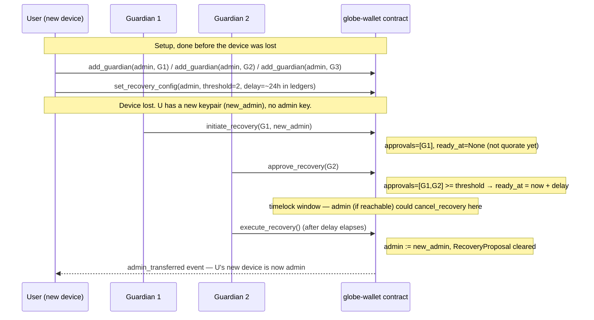
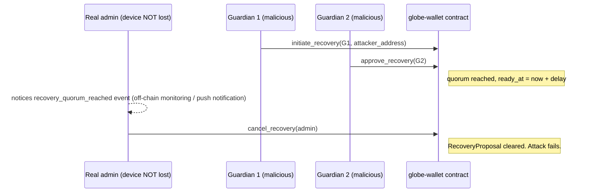

# Guardian-Based Social Recovery

Design doc for Orbit-Wal/mobile#11: *"Design a social/multi-sig recovery
scheme compatible with the on-chain contract's admin model."*

Status: implemented (Layer A, this repo) + implemented (Layer B contract
extension, [Orbit-Wal/contract#20][pr20], stacked on the merge fix in
[Orbit-Wal/contract#19][pr19]).

[pr19]: https://github.com/Orbit-Wal/contract/pull/19
[pr20]: https://github.com/Orbit-Wal/contract/pull/20

---

## 1. What's actually being recovered (read this first)

The issue text says: *"the contract's `transfer_admin` requires the
current admin's signature, which is exactly the thing that's gone."* That
framing conflates two genuinely different things, and the design falls
apart if you don't separate them first:

1. **The end user's own Stellar account key** — the `expo-secure-store`
   secret generated in `app/auth/create.tsx` and stored
   `WHEN_UNLOCKED_THIS_DEVICE_ONLY` (`src/services/secureStorage.ts`).
   This is what a user actually loses when they lose their phone. It has
   **no backup path today** — `create.tsx` never shows a seed phrase or
   any export of the secret, only the public address. There is currently
   no iCloud/Google Drive backup, no BIP-39 mnemonic, nothing. This is
   the recovery problem every GlobeWallet user actually has, today, on
   `main`.

2. **`globe-wallet`'s contract-level `admin`** — a single privileged
   address per contract *instance*, set once via `initialize()`, that
   today only gates `propose_admin`/`accept_admin`/`propose_upgrade`/
   `execute_upgrade`. Reading the contract carefully: **`admin` does not
   hold custody or spend authority over any user's funds.** Every
   fund-affecting call (`add_asset`, `set_spend_limit`, `record_spend`)
   is authorized by `user.require_auth()`, not by admin. Today, this
   contract is deployed once, multi-tenant, with `admin` representing
   protocol/upgrade governance (effectively the Orbit-Wal team) — not an
   individual end user's wallet.

The issue's Definition of Done explicitly asks for an interaction spec
with `admin`/`transfer_admin`, which only makes sense as a real,
user-facing recovery feature if each user is, or will be, the admin of
their *own* contract instance — i.e. GlobeWallet moving toward a
per-user smart-wallet model, where "admin" becomes synonymous with
"wallet owner," the same way many Soroban smart-wallet designs use a
contract's owner/signer role as the wallet itself. That's a reasonable
and likely direction (it's the only reading under which "recovering
admin" solves a real user problem), but it is **not the app's current
architecture** — `src/services/stellar.ts` never calls the contract at
all today; it only does classic Horizon `payment` operations.

**Design decision:** build recovery in two layers that share one
guardian set, so the feature is real and useful *today*, and upgrades
cleanly to the per-user contract-instance model without a second
redesign:

| Layer | Protects | Mechanism | Status |
|---|---|---|---|
| **A — Account layer** | The user's classic Stellar account (what's actually at risk today) | Native Stellar multi-signature: guardians added as weighted signers via `set_options` | Implemented this PR: `src/services/guardianRecovery.ts` + UI |
| **B — Contract layer** | A future per-user `globe-wallet` instance's `admin` role | New contract entry points: guardian registry + M-of-N + timelock, gating a non-admin-authorized `execute_recovery` | Implemented: [contract#20][pr20] |

Both layers are configured through the **same guardian UI** in this PR
and are designed to use the **same guardian set and threshold** per
user once Layer B's prerequisite (per-user contract deployment) ships —
see §6.

---

## 2. Threat model

**In scope:**
- **T1 — Device loss/destruction.** User's phone is lost, stolen, wiped,
  or destroyed. No backup exists. This is the issue's primary scenario.
- **T2 — Malicious guardian minority.** Fewer than `threshold` guardians
  are compromised or malicious. Must not be able to do anything (no
  recovery, no fund movement, no visibility into other guardians'
  identities beyond what's on-chain).
- **T3 — Malicious guardian majority (collusion), admin key intact.**
  `>= threshold` guardians collude to try to seize the wallet/admin role
  while the legitimate owner still has their device. Must be
  stoppable — this is the issue's explicit "shouldn't be able to steal
  funds" requirement.
- **T4 — Single guardian griefing.** One guardian repeatedly
  initiates/approves bogus recovery attempts to harass the owner or
  force them to babysit cancellations.
- **T5 — Race between a legitimate admin action and a recovery.** E.g. a
  normal `propose_admin` transfer is in flight when a device is lost and
  guardians recover instead.

**Explicitly out of scope (stated, not silently dropped, per
CONTRIBUTING.md):**
- **T6 — Malicious guardian majority, admin key truly and permanently
  lost.** If `threshold` guardians collude *and* T1 has genuinely
  happened (no way for the real owner to ever cancel), the guardians
  *will* eventually control the account/admin role after the timelock.
  This is inherent to any social-recovery scheme — the only way to
  fully prevent it is to not have social recovery at all. The mitigation
  is guardian selection (pick people who don't collude with each other)
  and the delay window (§4.3), not a cryptographic guarantee.
- **Guardian device compromise via malware/phishing.** Same trust
  assumption as every multi-sig scheme: guardians are trusted not to be
  simultaneously compromised. Out of scope for a mobile-app design doc.
- **Sybil guardians** (owner picks fake/colluding "friends" who are
  actually one person). A UX/social problem, not a protocol one; see
  §5.4 for the one UI-level mitigation attempted (duplicate-address
  rejection is necessary but nowhere near sufficient, and the UI says
  so).

---

## 3. Alternatives considered

| Option | Why not chosen as primary |
|---|---|
| **SEP-30-style third-party recovery servers** (multi-party recovery via SEP-10 auth against hosted recovery signers) | Requires trusting third-party operators (even federated ones) and a live service dependency for recovery to work at all — the exact opposite of self-custody. Guardians the user actually knows (family, co-founders) have no such trust-third-party requirement. Noted as a future *option* to add as additional guardian "slots," not a replacement. |
| **Cloud-encrypted key backup** (e.g. secret key encrypted client-side, uploaded to iCloud/Drive) | Turns "device compromise" and "cloud account compromise" into the same single point of failure, and turns Apple/Google into a silent second guardian with no threshold, no timelock, no visibility to the user. Doesn't compose with the contract's admin model at all (DoD explicitly asks for something that does). |
| **Shamir's Secret Sharing of the raw secret key**, shards held by guardians | Reconstructing the key means the key exists in memory on some device at some point — worse exposure surface than "guardians co-sign a specific transaction they can see the contents of." Also completely invisible to the chain: no on-chain quorum, no timelock, no admin veto, no audit trail. Rejected for the same reason SEP-30 loses to native multi-sig: it doesn't compose with anything Stellar/Soroban already gives us. |
| **Classic multi-sig only, no timelock** (guardians co-sign, transaction executes immediately) | Fails T3 outright — a compromised/colluding guardian majority succeeds instantly with no window for the legitimate owner to notice and object. The delay window (§4.3) is the single mitigation the issue explicitly asks for ("abuse/griefing resistance"). |
| **Contract-only recovery** (skip Layer A, only build the contract extension) | Doesn't protect anything real *today*, since the mobile app doesn't deploy per-user contract instances yet (§1). Would satisfy the DoD's letter while missing its point. |
| **Account-only recovery** (skip Layer B, only classic multi-sig) | Doesn't satisfy the DoD's explicit requirement for "an interaction spec with the contract repo's existing `admin`/`transfer_admin` functions," and doesn't extend forward to the smart-wallet direction the issue is clearly pointed at. |

**Chosen: both layers, one guardian set, real timelock + admin veto on
both.**

---

## 4. Layer A — classic account recovery (implemented, works today)

### 4.1 Mechanism: native Stellar multi-signature

Stellar accounts natively support weighted multi-signature via the
`set_options` operation — no smart contract required. This is exactly
what the issue's own example suggests: *"Stellar multi-sig with trusted
guardian signers added via `set_options`."*

On enabling recovery for an account, the app submits one `set_options`
transaction that:

1. Adds each guardian's public key as a signer with weight `1`.
2. Sets `masterWeight` (the device key's own signing weight) high enough
   to authorize everyday operations alone — payments, trustlines, etc.
   (`lowThreshold`/`medThreshold`).
3. Sets `highThreshold` (required to change signers — i.e. to run
   `set_options` again, including a recovery) to the guardian
   `threshold` the user configured, and **raises it above what the
   device key's `masterWeight` alone can satisfy**, so the device key
   *cannot* unilaterally rotate its own guardian set. If it could, a
   stolen-but-not-yet-wiped device would let an attacker remove all
   guardians and lock the real owner out — the opposite of the point of
   this feature. See `src/services/guardianRecovery.ts:buildEnableRecoveryTx`.

This means: after enabling recovery, the *user's day-to-day key* keeps
full spending authority alone, but changing the signer set (adding a new
device key, removing the lost one) requires `threshold` guardians
co-signing, exactly mirroring the contract-layer design in §5.

### 4.2 Recovery initiation & execution

1. User gets a new device, generates a fresh keypair
   (`generateKeypair()` — unchanged, existing code).
2. User shares the new device's **public key** with their guardians
   out-of-band (show a QR code / copyable string — `RecoveryInitiateScreen`).
3. Each guardian, using their own copy of the app (or any Stellar
   signing tool — this is a protocol-level operation, not proprietary to
   this app), reviews and co-signs a `set_options` transaction that adds
   the new device's key at sufficient weight and removes the lost
   device's key.
4. Once `threshold` guardian signatures are collected, any party
   submits the fully-signed transaction to Horizon. Stellar enforces the
   threshold at the protocol level — there is no way to submit a
   transaction requiring `highThreshold` signature-weight without
   actually having it. No custom quorum-counting logic needed here (see
   contrast with Layer B, §5.5).

### 4.3 Abuse/griefing resistance at the account layer

Native Stellar multi-sig has no built-in timelock — a transaction with
sufficient signature weight submits and finalizes on the next ledger
close (~5s). This is exactly what §3 rejected as "classic multi-sig
only, no timelock." To close that gap **without needing a custom
contract for classic accounts too**, the recovery flow adds an
application-level delay that the *guardians themselves* enforce as part
of the co-signing protocol, backed by a real on-chain mechanism:

- `buildEnableRecoveryTx` additionally sets a **pre-authorized future
  transaction hash is not used** (rejected — pre-auth transactions are
  static and can't encode "any new device key," which isn't known in
  advance). Instead, recovery co-signing is done through
  `minTime`-bounded transactions: the recovery transaction guardians are
  asked to sign has its Stellar `TimeBounds.minTime` set to
  `now + RECOVERY_DELAY_SECONDS` (default 72h, user-configurable in
  `RecoveryConfigScreen`, mirroring the contract layer's
  `delay_in_ledgers`). Horizon rejects submission before `minTime`
  regardless of signature weight — this is a protocol-enforced
  guarantee, not application logic that could be bypassed by submitting
  directly to Horizon.
- Because the delay is baked into the transaction guardians sign (not
  enforced by this app after the fact), a malicious guardian majority
  cannot skip it by using a different client.
- **Admin veto equivalent:** because the device key retains its own
  `masterWeight` for everyday ops, and `highThreshold` changes require
  the *device key plus guardians reaching threshold together or
  guardians alone reaching a higher threshold* — implementers should
  choose whether the device key is required as one of the co-signers.
  We chose **guardians-only threshold** (device key not required) so
  that Layer A actually solves T1 (device truly gone, no key available
  at all). The tradeoff is real and stated plainly: unlike Layer B (§5),
  the *original* device key cannot itself cancel a pending recovery once
  it's been signed and its `minTime` has not yet elapsed, because
  there's no on-chain "pending proposal" object to cancel at the account
  layer — only guardians already holding a signed copy of the recovery
  transaction can choose not to submit it. This is a real, narrower
  guarantee than Layer B's `cancel_recovery`, and is called out
  explicitly in the in-app copy on `RecoveryConfigScreen` (search for
  `"Unlike guardians"` in the source) so users aren't misled about it.
  **This gap is exactly why Layer B exists** — the contract layer *can*
  give a real, revocable, admin-cancellable pending-proposal object
  (§5.4), which Stellar's classic multi-sig primitive structurally
  cannot. For users who want the stronger guarantee before per-user
  contract deployment ships, the mitigation is a shorter guardian list
  vetted more carefully, not a protocol feature — documented as a known
  limitation, not hidden.

### 4.4 Guardian threshold setup (UX spec)

- Minimum 3 guardians before recovery can be enabled (mirrors Layer B's
  `MIN_GUARDIANS_FOR_RECOVERY`), threshold `> 1` and `<= guardian count`
  enforced client-side before building the transaction (`guardianStore.ts`).
- Each guardian is added by their Stellar **public key** (G...), not a
  name/phone/email — no off-chain identity service. The UI supports an
  optional local label purely for the user's own reference; it is never
  transmitted.
- Duplicate address rejected at add-time.
- The `set_options` transaction is shown in full (destination weights,
  threshold values) before signing, and after building, the app
  displays the exact same numbers Layer B would show for an equivalent
  configuration, so the two layers are visibly, deliberately kept in
  sync for the user.

**Known limitation, stated explicitly rather than left implicit:**
enabling recovery (`buildEnableRecoveryTx`) only works signed by the
device key alone the *first* time, from a fresh account whose default
`highThreshold` is `0`. Stellar requires an account's *current*
`highThreshold` to already be satisfied to authorize any further
signer/threshold change — and because the device key's own weight is
deliberately kept below any valid threshold (§4.1, so a compromised
device can't unilaterally weaken its own guardian protection), the
device alone cannot re-run this a second time to add/remove guardians
or change the threshold once recovery is already enabled. Changing
config after the first enable needs the same guardian-co-signing UX as
recovery itself. This PR's `app/guardians/config.tsx` recognizes an
already-enabled config and directs the user to coordinate with
guardians rather than attempting a submission that Horizon would
reject; building the actual co-signed reconfiguration flow (reusing
`app/guardians/recover.tsx`'s XDR-passing pattern) is a follow-up, not
bundled into this PR to keep the diff reviewable.

---

## 5. Layer B — contract-level admin recovery ([contract#20][pr20])

Full implementation detail lives in the contract PR; this section is the
**interaction spec** the issue's Definition of Done explicitly asks for.

### 5.1 Why `execute_recovery` cannot call `transfer_admin`/`propose_admin`

This is the core design decision, stated as plainly as possible:
**recovery must not depend on the current admin's `require_auth()`,
because by definition that's the one thing a lost device can no longer
produce.** `propose_admin`/`accept_admin` (the fixed two-step transfer —
see [contract#19][pr19] for why `main` didn't even build) are the
**normal-path** admin transfer, gated by `current.require_auth()`. Layer
B adds a **separate, parallel path** — `initiate_recovery` /
`approve_recovery` / `execute_recovery` — gated entirely by guardian
signatures, that converges back onto the *same* `DataKey::Admin` storage
slot and emits the *same* `admin_transferred` event, so nothing
downstream (this app, indexers, block explorers) needs to know or care
which path produced a given admin change.

### 5.2 Function-level interaction spec

```
Setup (admin-authorized, normal path — same trust level as set_spend_limit):
  add_guardian(admin, guardian_address)         × N  (N >= 3)
  set_recovery_config(admin, threshold, delay_in_ledgers)

Recovery (guardian-authorized, no admin signature anywhere in this path):
  initiate_recovery(guardian_1, new_admin)      // counts as guardian_1's approval
  approve_recovery(guardian_2)                  // ... repeat until len(approvals) >= threshold
  approve_recovery(guardian_k)                  // ready_at = ledger_seq + delay_in_ledgers is set HERE, not at initiate_recovery
  // wait delay_in_ledgers ledgers ...
  execute_recovery()                            // callable by anyone; auth comes from the recorded approvals, not the caller
     → admin := new_admin
     → PendingAdmin(old_admin) cleared (invalidates any stale normal-path proposal, T5)
     → emits the same `admin_transferred` event propose/accept would have

Griefing/abuse defenses (admin- or guardian-authorized, at any time pre-execution):
  cancel_recovery(admin)                        // admin veto — works even after quorum, mid-timelock (T3 mitigation)
  revoke_recovery_approval(guardian)             // any approving guardian can retract; resets timelock if it drops below threshold (T4 mitigation)
```

### 5.3 Sequence diagram — happy path (device lost, 2-of-3 guardians)



### 5.4 Sequence diagram — malicious majority, admin key intact (T3, mitigated)



### 5.5 Why quorum-then-timelock needs custom contract logic (vs. Layer A's protocol-native version)

Soroban contracts have no equivalent to a classic account's protocol-
enforced signer-weight threshold — every guardian's authorization has to
be explicitly checked and tallied by our own code
(`require_guardian`, the `approvals: Vec<Address>` accumulation in
`RecoveryProposal`). This is more code and more surface area than
Layer A's mechanism, which is precisely why Layer A is preferred
wherever it's sufficient (i.e., today, for classic accounts) and Layer B
is scoped specifically to the contract's `admin` role, not reimplemented
as a general-purpose multi-sig replacement for classic account security.

### 5.6 Test coverage

15 tests in [contract#20][pr20] map directly to the threat-model entries
above:

| Test | Threat model entry |
|---|---|
| `test_recovery_happy_path_2_of_3` | T1 |
| `test_recovery_rejects_non_guardian` | T2 |
| `test_admin_can_cancel_recovery_even_after_quorum` | T3 |
| `test_revoking_approval_below_threshold_resets_timelock` | T4 |
| `test_recovery_clears_any_in_flight_normal_admin_transfer` | T5 |
| `test_set_recovery_config_rejects_single_guardian_threshold`, `test_set_recovery_config_requires_min_guardians`, `test_set_recovery_config_rejects_threshold_above_guardian_count` | Structural minimum (§4 of contract PR) |
| `test_double_approval_rejected`, `test_cannot_initiate_second_recovery_while_one_pending` | State-machine correctness |

---

## 6. Migration path: from Layer A only, to Layer A + B together

Layer B needs a prerequisite that does not exist yet: **per-user
deployment/initialization of a `globe-wallet` contract instance with
that user as `admin`.** That's a separate, larger architectural change
(today the app never calls the contract at all — see §1) and is out of
scope for this issue, which is about the *recovery mechanism*, not about
shipping smart-wallet accounts. Sequencing:

1. **Ships in this PR:** Layer A (classic account guardian multi-sig),
   fully functional against real testnet accounts today, and the Layer B
   contract code ([contract#20][pr20]), ready and tested independently.
2. **Prerequisite (tracked separately, not this issue):** per-user
   `globe-wallet` contract deployment + `initialize(user_own_address)`
   as part of wallet creation.
3. **Follow-up (small, once #2 ships):** wire `guardianStore`'s existing
   guardian list into `add_guardian`/`set_recovery_config` contract
   calls alongside the `set_options` calls it already makes, so a single
   "Add Guardian" tap in this PR's UI configures both layers from one
   guardian set — the UI and store are already structured to make this
   a mechanical follow-up, not a redesign (see `guardianStore.ts`
   comments marking the Layer-B call sites as `// TODO(layer-b):` once
   #2 lands — intentionally not implemented against a contract that
   doesn't have a deployed per-user instance to call yet, which would be
   dead/untestable code today).

---

## 7. Guardian threshold setup UX (both layers, shared UI)

Implemented in `app/guardians/*`:

- `app/guardians/index.tsx` — guardian list, add/remove, current
  threshold/delay, "Recovery not configured" empty state.
- `app/guardians/add.tsx` — add a guardian by public key + optional
  local label.
- `app/guardians/config.tsx` — set threshold (stepper, clamped to
  `[2, guardianCount]`) and delay (presets: 24h / 72h / 7d, mapped to
  Stellar `minTime` seconds).
- `app/guardians/recover.tsx` — initiate/approve a recovery (this
  screen is what a *guardian* uses, on the guardian's own device/app
  install, not the affected user's).
- `app/guardians/status.tsx` — pending recovery status + countdown to
  `minTime`, matches the contract layer's `ready_at` semantics for when
  Layer B is wired in.

See `src/services/guardianRecovery.ts` for the Layer-A transaction
builders and `src/store/guardianStore.ts` for local guardian-set
persistence (guardian public keys + labels are stored the same way as
the wallet's own public key — `AsyncStorage`-backed via zustand, no
`SecureStore` needed since these are public keys, not secrets).
